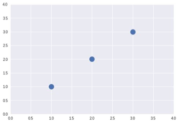

# Simple Linear Regression

* ## Regression?

     *"Regression toward the mean"*
     
     전체의 평균으로 되돌아 간다. 어떤 데이터들이 굉장히 크거나 굉장히 작아도 결과적으로 전체 평균으로 회귀하려는 특징, 속성이 있다.
* ## Linear Regression

    데이터를 가장 잘 대변하는 직선의 방정식을 찾는것

    

    데이터가 분포되어 있을때, 파란색 점 전체를 가장 잘 대변하도록 직선을 그을 때 이 직선은 어떤 모습이 될까

    y=ax+b

    파란색점들을 가장 잘 대변하는 직선의 기울기와 y절편을 구한는것

    ex)

    x | y
    -|-
    1 | 1
    2|2
    3|3   
    
    
 

* ## Hypothesis (Linear)
  
  H(x)=Wx+b-> 우리의 가설

  이 직선식이 이 데이터를 가장 잘 대변하고 있다고 가정

  W와b를 어떻게 정의할 수 있을까

 * ## cost

    

    *Hypothesis와 실제 데이터의 차이 lost,error라고도 불린다*

    H(x)-y -> 빨간색 선들의 총합이 작으면 작을수록 데이터를 잘 대변하고있다고 할 수 있다.

    단 이 cost의 합이 최소화가 되도록만 한다면 문제가 생길 수 있다. 어떤부분은 양수 어떤부분은 음수로 나타난다. 따라서 제곱하여 사용한다.

    실제 데이터의 fit 시키는 것이 우리의 목표이다.

* ## cost function

    

     

    W= weight,  b=bios

    오차 제곱의 평균

* ## Goal: Minimize cost
